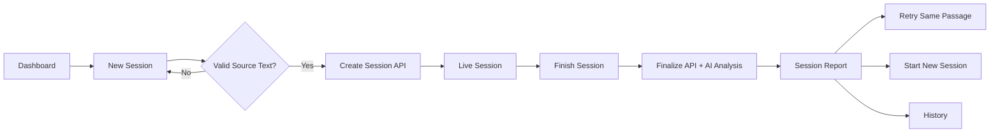
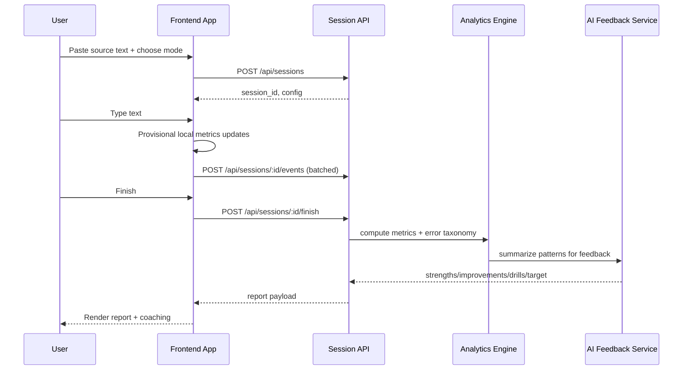

# Frontend Screens & Data Flow Blueprint

## 1. Screen Inventory

| Screen | Route | Primary Goal | Core Components |
|---|---|---|---|
| Dashboard | `/` | Progress overview and quick start | TopNav, KPI cards, Trend graph, Recent sessions |
| New Session | `/session/new` | Accept passage and configure session | PassageInput, SessionConfigPanel |
| Live Session | `/session/:id/live` | Capture typing and show live metrics | SourcePane, TypingPane, LiveMetricsBar |
| Session Report | `/session/:id/report` | Explain performance and coaching | KPI cards, ErrorHeatmap, AiFeedbackCard |
| History | `/history` | Compare sessions over time | Filters, HistoryTable, TrendChart |
| Settings | `/settings` | Personalize app behavior | Theme, accessibility, privacy controls |

## 2. User Journey Flow

## 3. Runtime Data Flow (Frontend + Backend)

## 4. Frontend State Ownership

### Local UI State
- Input focus, panel collapse, modal visibility, chart toggles.

### Session Runtime State
- Current typed text, elapsed time, provisional WPM, accuracy, backspace count.

### Server State
- Session object, final report payload, historical trend aggregates.

## 5. Event Batching Strategy
- Buffer key events in-memory queue.
- Flush every 2–5 seconds or every 100 events.
- Flush immediately on pause/finish/tab-hidden.
- Retry with exponential backoff on transient failures.

## 6. Error Handling UX
- If event upload fails, keep local queue and show subtle sync badge.
- If finalize fails, allow retry from “Session Complete” interim page.
- If AI feedback is delayed, show performance report first and lazy-load coaching panel.

## 7. Responsive Behavior
- Desktop: side-by-side source and typing panes.
- Tablet: adjustable split ratio.
- Mobile: source pane on top, typing pane below; sticky metrics.

## 8. Accessibility Interaction Guidelines
- Full keyboard operability.
- ARIA live region for major metric changes.
- Color is not sole indicator for correctness (icons + text labels).
- Respect reduced-motion user preference for chart animations.
